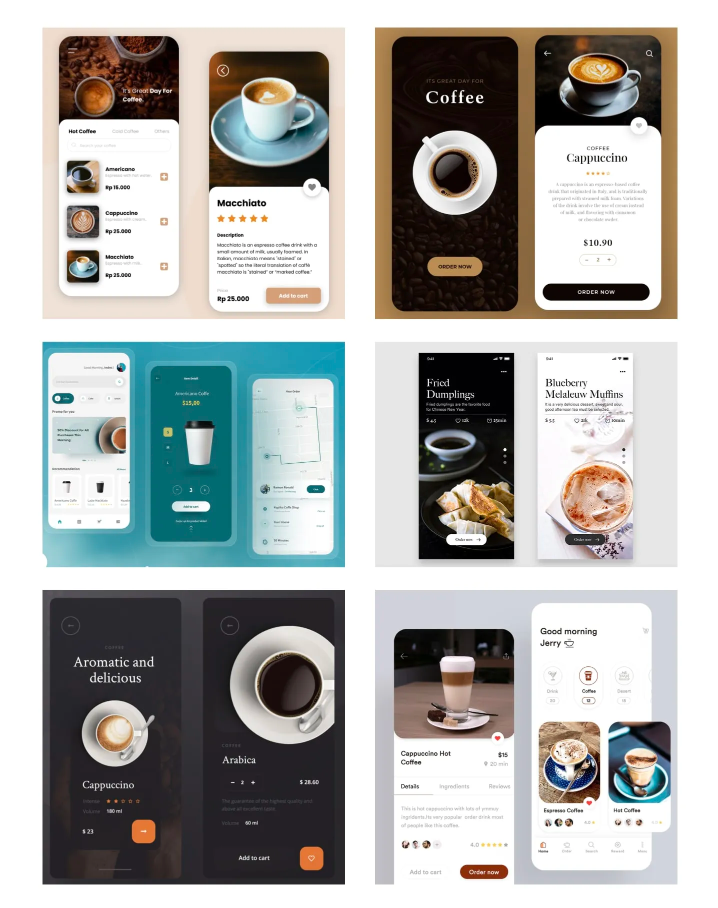
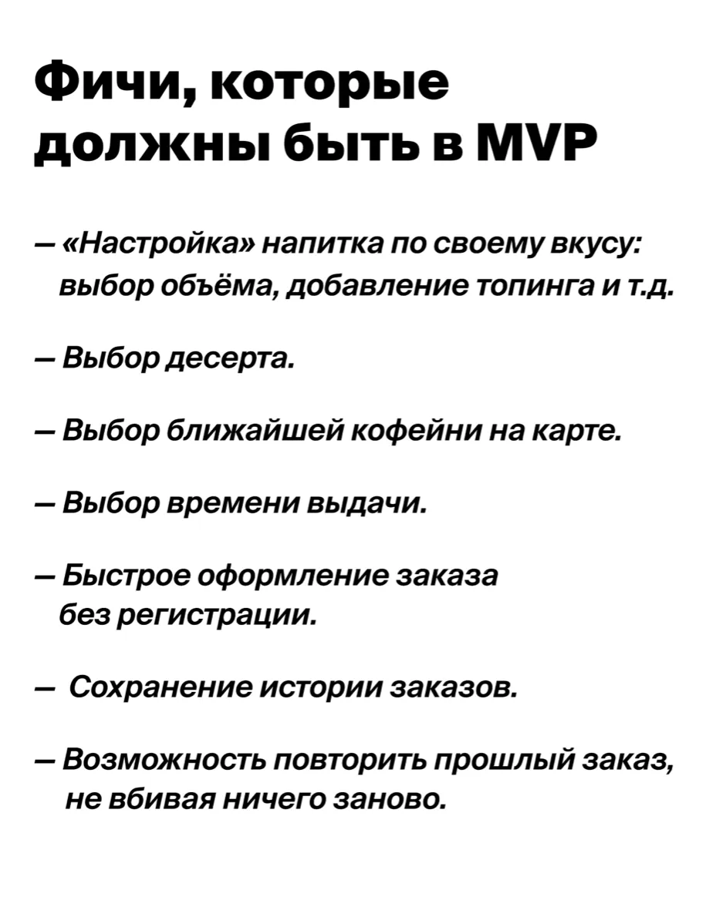

# Учебный проект курса Kotlin Backend Developer. Поток курса 2023-06

### Click Coffee - это мобильное приложение, которое позволит заказывать кофе онлайн, а потом быстро забрать его в ближайшем пункте выдачи. Там не нужно будет ни платить, ни ждать, пока напиток сварят.

## Визуальная схема фронтенда:

## MVP:

<h2>
1. Маркетинг:
</h2>
<h3>

- [Проблема, которую решает продукт](./docs/01-marketing/problem-resolving.md)
- [Заинтересанты](./docs/01-marketing/stakeholders.md)
- [Целевая аудитория](./docs/01-marketing/target-audience.md)
- [Конкуренты](./docs/01-marketing/concurrency.md)
- [User flow](./docs/01-marketing/user-flow.md)

</h3>

<h2>
2. DevOps:
</h2>

<h3>

- [Схема инфраструктуры](./docs/02-devops/devops.md)
- [Схема мониторинга](./docs/02-devops/monitoring.md)

</h3>

<h2>
3. Тесты
</h2>
<h2>
4. Архитектура
</h2>

<h3>

1. [Компонентная схема](./docs/04-architecture/01-arch.md) 
2. [Интеграционная схема](./docs/04-architecture/02-integration.md)
3. [Описание API](./docs/04-architecture/03-api.md)

</h3>