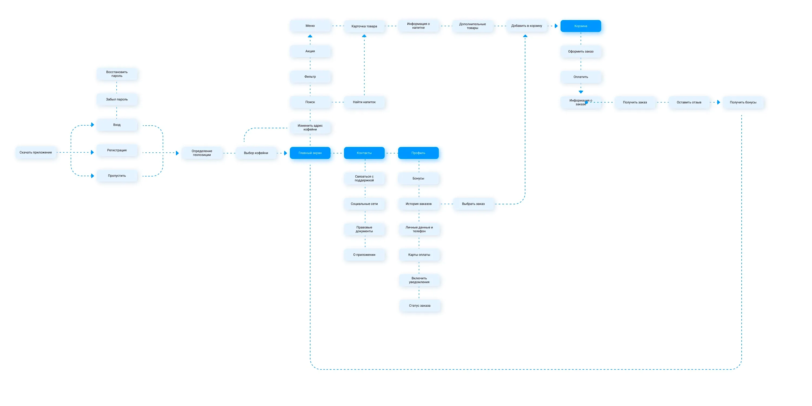
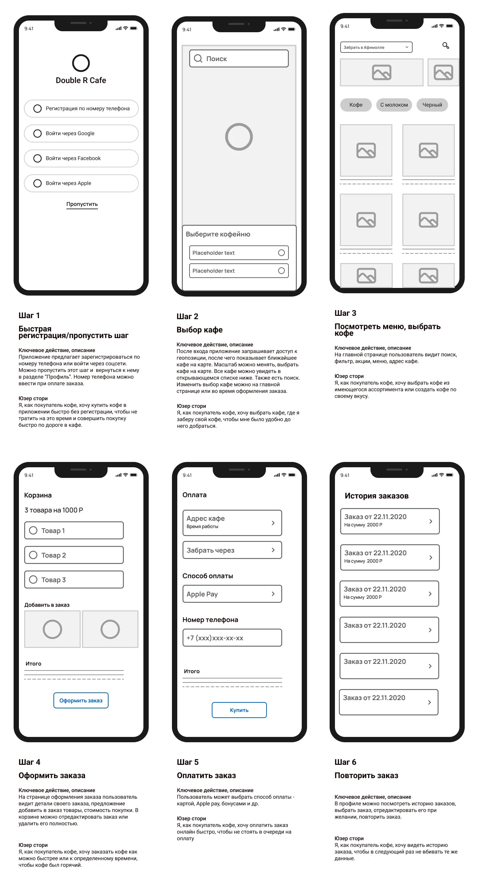
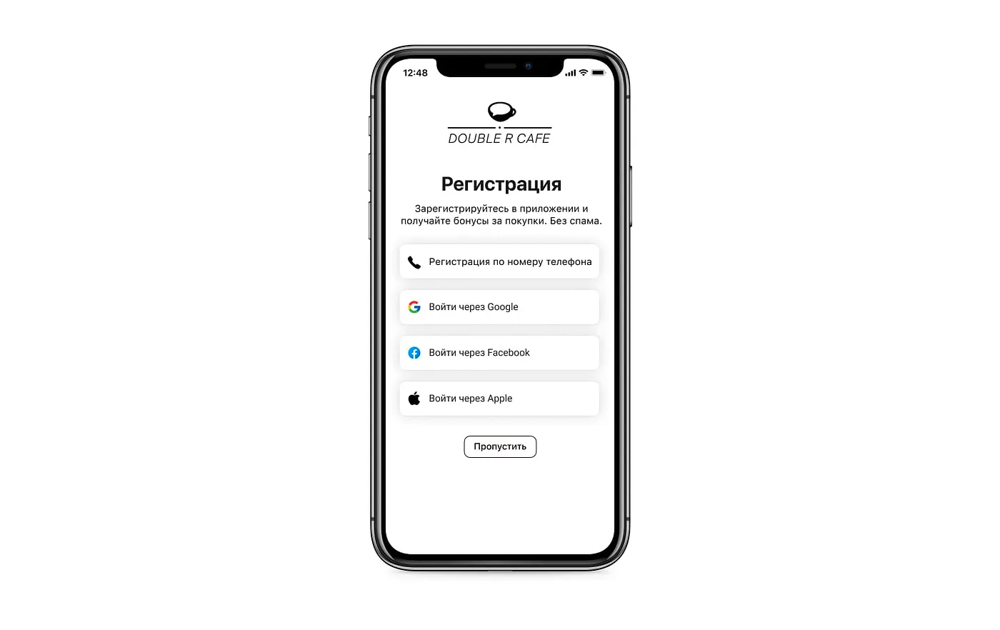
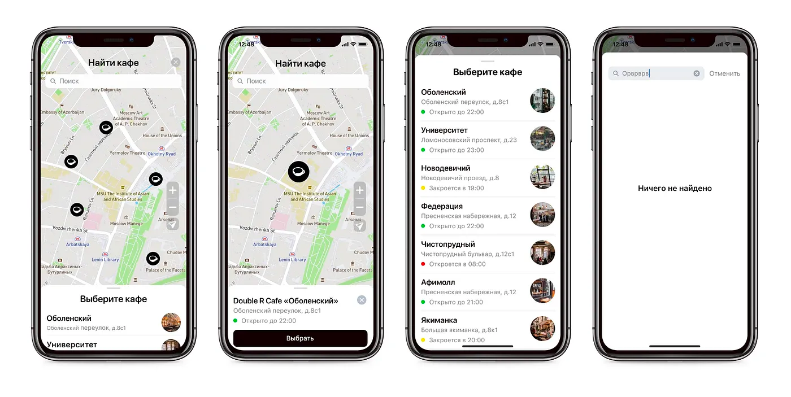
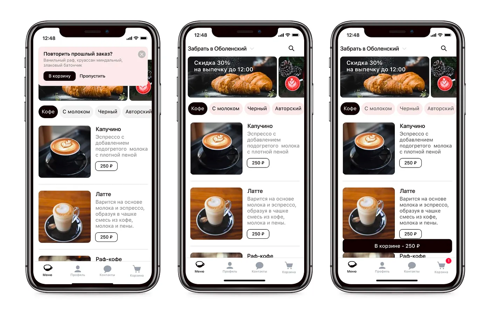
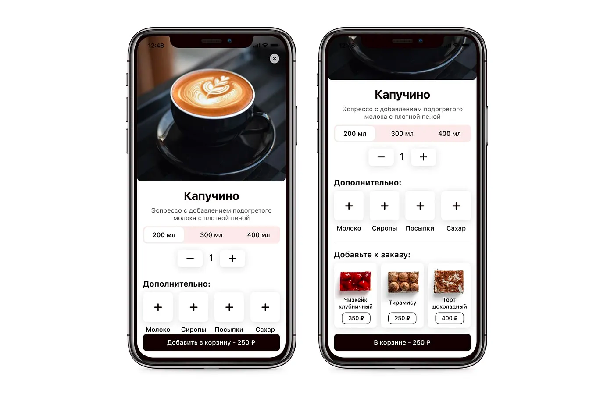
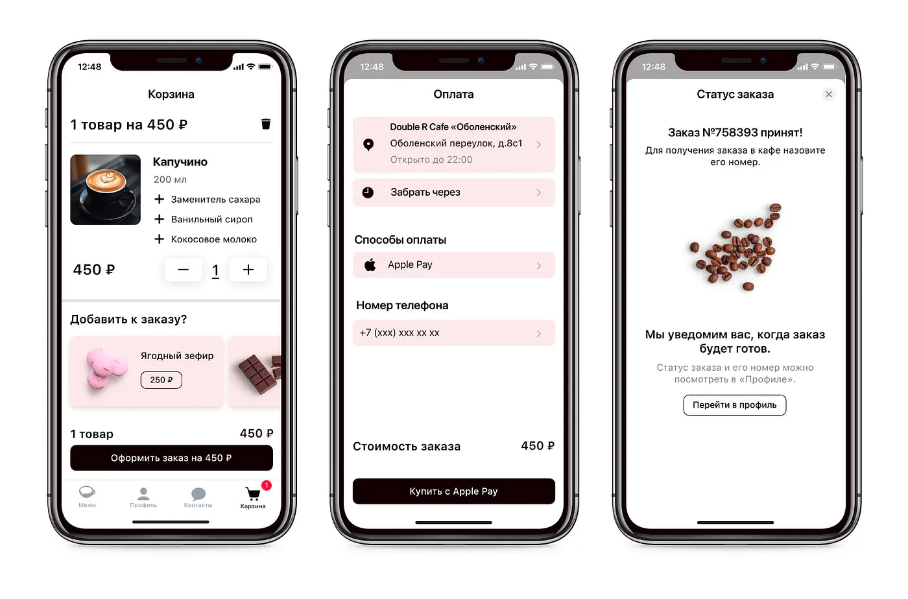
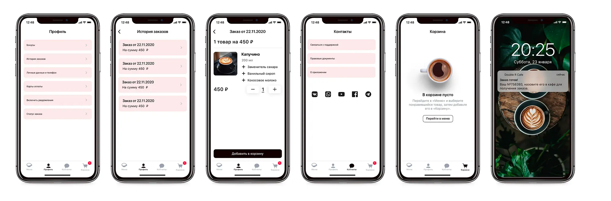

# User FLOW

## Сценарий покупки кофе:

### 1. Быстрая регистрация/пропустить шаг

Можно пропустить регистрацию и ввести номер телефона на этапе оплаты заказа.

### 2. Поиск кафе

После входа в приложение пользователь попадает на страницу поиска кафе, которое можно найти на карте или выбрать из списка. Этот шаг можно пропустить и вернуться к нему на главной странице.

### 3. Меню

Чтобы заказать кофе быстро и не вбивать каждый раз одни и те же данные, приложение предлагает повторить прошлый заказ. Можно сразу перейти в корзину и при желании отредактировать заказ там. Можно пропустить и выбрать кофе из меню.

### 4. Карточка товара

В карточке товара пользователь видит не только название кофе, но и его описание, так как не все знают, что скрывается под ярким названием “Флэт Уайт” или “Кортадо”. Можно выбрать объем и количество кофе, добавить топпинги и сладости.

### 5. Корзина и оплата

В корзине видим данные о заказе, возможность отредактировать заказ и добавить что-нибудь. На странице оплаты можно еще раз проверить, правильно ли выбрано кафе и адрес, при желании отредактировать этот пункт. Далее нужно выбрать время получения заказа и способ оплаты, потом ввести номер телефона. После оплаты приложение говорит пользователю, что все хорошо и его заказ принят, можно ожидать уведомления, когда заказ будет готов.

### 6. Дополнительные экраны

История заказов хранится в «Профиле». Каждый заказ можно добавить в корзину, не вбивая ничего заново. При желании заказ можно отредактировать или добавить что-то в корзине.